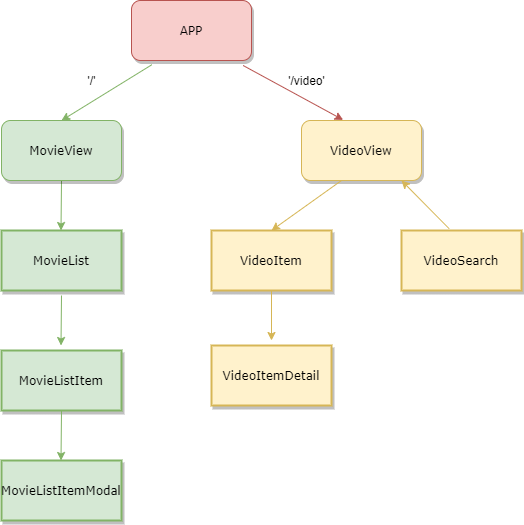
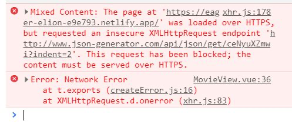
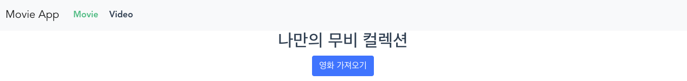
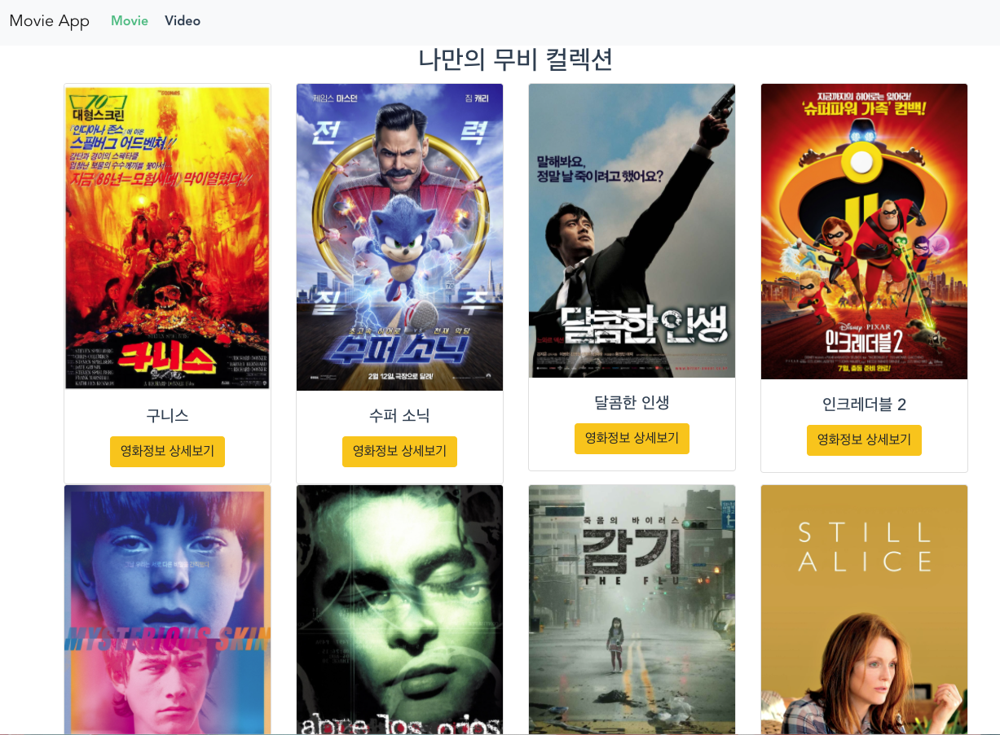
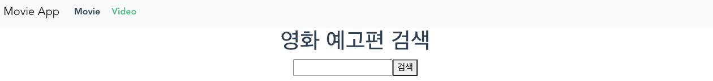
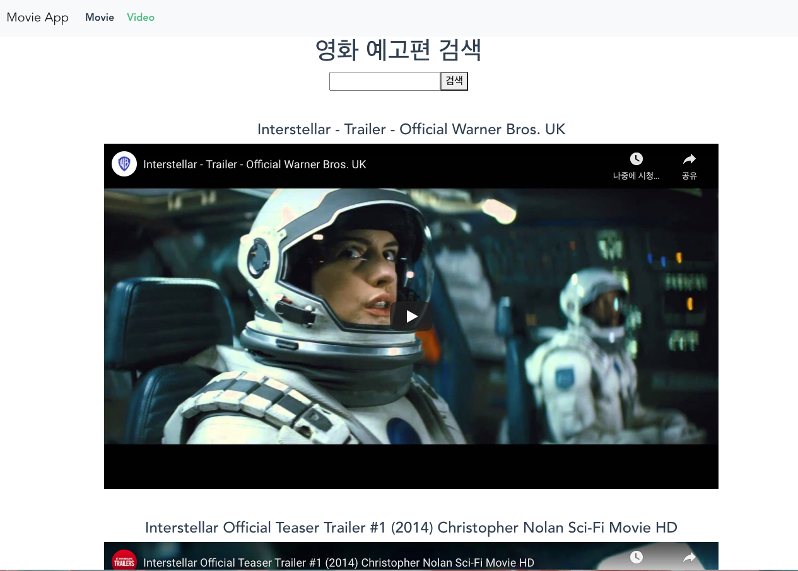

# :clapper: Vue Project

## 프로젝트 소개

### 🙎‍♂️🙍‍♀️ 프로젝트 멤버

- 황수민
- 신영찬
- 신채린

<br>

### 💻 기술 스택

- | Framework | 라이브러리 |
  | --------- | ---------- |
  | Vue.Js    | Bootstrap  |
  |           | Axios      |

<br>

### 📂 컴포넌트 구조



<br>

### 📌 기능

- 영화 가져오기 버튼을 누르면, 영화를 가져옵니다.
  - 개별 영화를 클릭했을 때, 상세 줄거리와 포스터 사진이 보여집니다.
- 영화 이름 검색 시, 검색한 영화의 예고편들을 보여줍니다. 
  - 검색어가 없는 경우, 영화 예고편을 받아올 수 없습니다.

<br>

## Discussion

- App.vue에 MovieView.vue에 VideoView.vue를 추가하기.
- routing의 필요성 (2개만 필요) MovieView와 VideoView를 만들기
- Convention 맞추기
  - import 할 때 `'../components/MovieListItemModal.vue'`
    - 끝에 확장자 (vue) 넣을지 말지 결정

<br>

## 구현 과정

### ⚙️ 초기 설정

#### 라우터 추가

- ```bash
  $ vue add router
  ```

<br>

#### 컴포넌트 생성

- 사용할 컴포넌트를 모두 생성하였습니다. (`MovieList.vue`, `MovieListItem.vue`, `MovieListItemModal.vue`, `VideoItem.vue`, `VideoItemDetail.vue`,` VideoSearch.vue`)

<br>

#### 폴더 구조 

- 메인 페이지에서 보여줄 두 컴포넌트 `MovieView.vue`와 `VideoView.vue`를 제외하고, 다른 컴포넌트들은 `components` 폴더 안에 넣었습니다 .
- `MovieView.vue`와 `VideoView.vue`는 `views` 폴더 안에 넣었습니다.

<br>

#### `router/index.js` 추가

- 1. `index.js` 파일에 `MovieView.vue`와 `VideoView.vue`를 import 시켰습니다.
- 2. routes에 Movie와 Video의 path, name, component를 설정하였습니다.

<br>

##### ⚙️ url

- `MovieView.vue`는 `'/'`로 url을 생성하였습니다.
- `VideoView.vue`는 `'/video'`로 url을 생성하였습니다.

<br>

### App.vue

#### navigation 추가

- navigation은 bootstrap에서 가져왔습니다.
- 그리고 각 메뉴를 클릭했을 때, `<router-link to="/">Movie</router-link>`와 같은 형식으로 활용하였습니다.

<br>

### Movie

#### MovieView.vue

##### Axios 사용

- 버튼을 눌렀을 때 Axios를 통해 movies 배열을 가져왔습니다.
- 이를 data에 movies에 저장하였습니다.

```js
methods: {
    onButtonClick() {
      axios.get('https://www.json-generator.com/api/json/get/ceNyuXZmwi?indent=2')
        .then(
          res => {
            this.movies = res.data
          })
        .catch(err => console.error(err));
    }
  }
```


##### v-bind 사용

- Axios를 통해 받아온 movies 배열을 v-bind로 `MovieList.vue`에 보내줍니다.

```html
<MovieList :movies="movies"/>
```

<br>

#### MovieList.vue

##### 컴포넌트 설명

- 영화 리스트들이 들어올 영역입니다.

<br>

##### props 사용

- `MovieView.vue`에서 넘긴 movies를 props에 데이터 타입을 지정해 준 후 받아왔습니다. 

```js
import MovieListItem from './MovieListItem.vue'

export default {
  name : 'MovieList',
  components: {
    MovieListItem
  },
  props: {
    movies: Array,
  },
}
```


##### v-for를 통한 MovieListItem.vue를 만들기

- v-for를 이용해 movies의 객체들을 하나씩 돌면서 MovieListItem으로 넘겨줍니다.

```html
<MovieListItem class="col-3" :movie = "movie" v-for="movie in movies" :key="movie.id"/>
```


#### MovieListItem.vue

##### 컴포넌트 설명

- 개별 영화가 들어올 영역입니다. col-3을 이용해 row의 4분의 1을 차지할 수 있도록 하였습니다.

##### props 사용

- `MovieListItem.vue`에서는 `MovieList.vue`에서 v-bind로 넘어온 movie를 받아서, 해당 영화의 카드를 생성합니다.
  - `<script>` 내부에 `MovieList.vue`에서 넘어온 movie 데이터를 받기 위해 props를 이용하였습니다.

##### Bootstrap Card 사용

- 카드는 Bootstrap에 있는 코드를 이용하였습니다.

##### v-bind 사용

- 또한, `MovieListItemModal.vue`에 해당 영화를 넘겨주기 위해 v-bind를 이용해 movie를 사용하였습니다.

##### ❗️ 어려웠던 점

- 버튼을 눌렀을 때, 모달을 띄워야 하는데 버튼의 data-target과 모달의 id를 통일시키는 부분이 어려웠습니다.
- 특히, data-target의 id를 movie.id로 어떻게 만들지 고민했습니다.

##### :star: 해결

- ```vue
  <template>
  	
  </template>
  ```

  - concatenation을 통해 #movie와 movie.id를 같이 더해서 id를 선택할 수 있도록 만들었습니다.

<br>

#### MovieListItemModal.vue

##### 컴포넌트 설명

- 개별 영화를 클릭 시, 모달에 띄워줄 수 있도록 모달을 작성하였습니다.

##### Bootstrap Modal 사용

- 모달은 Bootstrap에 있는 Live Modal 코드를 이용하였습니다.

##### props 사용

- `MovieListItem.vue`에서 넘겨준 movie 데이터를 받기 위해 props를 이용하였습니다.

##### ❗️ 어려웠던 점

- 이미지를 아무런 attribute 없이 삽입했더니, Modal 밖으로 이미지가 나갔습니다.

##### :star: 해결

- 이를 해결하기 위해 구글링 하였고, 그 결과 Bootstrap4에 `img-fluid`라는 클래스가 있다는 점을 배웠습니다.
- `img-fluid`를 이용하니 부모인 Modal의 width에 맞춰 이미지 너비가 조정되었습니다.

<br>

### Video

#### VideoView.vue

##### API 사용

- `VideoView.vue` 컴포넌트 하위에서 공통적으로 사용하는 videos data을 관리합니다.

- videos
  - youtube API에 axios 비동기 통신 결과로 받아온 값들을 저장하는 배열입니다.

<br>

#### VideoSearch.vue

##### 컴포넌트 설명

- 사용자가 예고편을 궁금해하는 영화이 들어올 입력창과 버튼이 있습니다. 사용자는 엔터키를 누르거나 버튼을 눌렀을 때 요청을 보낼 수 있으며 빈 입력창에서 요청을 발생시키려고 하면 `alert()` 메소드가 발생하고 요청이 발생하지 않습니다. 요청이 발생할 때 입력창은 비워집니다.

##### v-model 사용

- v-model로 input과 바인딩해서 관리되는 값이다. youtube API요청을 보낼 때 사용합니다. 다만 요청을 보낼 때는 뒤에 'trailer'를 추가해서 보냅니다.

<br>

#### VideoItem.vue

##### 컴포넌트 설명

- 예고편 영상과 정보들이 들어올 영역입니다. VideoView에서 videos를 전달 받아 하위 컴포넌트인 `VideoItemDetail`에게 영상을 하나씩 쪼개서 전달해 줍니다. 

##### props

- API 요청 결과 받아온 videos배열이 저장되어 부모 컴포넌트로부터 전달 받은 데이터입니다.

<br>

#### VideoItemDetail.vue

##### props

- 부모컴포넌트로부터 전달받은 video 객체에서 영상을 보여주기 위한 `videoId`와 `title`을 이용했습니다.

##### computed

- 영상의 URL source를 저장할 때 사용했습니다.

  ```vue
  <scrript>
  computed: {
      videoUrl() {
        return `https://www.youtube.com/embed/${this.video.id.videoId}`;
      }}
  </script>
  ```

<br>

#### Key 관리

- 로컬에서 실행할 때는 `.env.local` 파일에 `VUE_APP_YOUTUBE_API_KEY`라는 변수명에 저장했습니다.
- 불러올 때는  `process.env.변수명`으로 불러와서 사용했습니다.

<br>

### Netlify 배포

#### :exclamation: 어려웠던 점



- mixed content 오류가 떠서 어떻게 해야할지 고민했습니다.


#### :star: 해결

```js
// src/views/MovieView.vue

axios.get('https://www.json-generator.com/api/json/get/ceNyuXZmwi?indent=2')
```

- 이 부분을 http → https로 수정하여 해결했습니다.

<br>

## 구현 화면

### 메인 화면



<br>

### 영화 가져온 후 화면



<br>

### 영화 정보 상세보기 모달 화면


<br>

### 영화 예고편 검색 메인 화면




<br>

### 영화 예고편 검색 화면 




<br>

## 느낀점

### 채린

- Vue.js를 배우기만 했었는데, 이번 프로젝트를 통해서 직접 코드를 짜보면서 props, 부모-자식 컴포넌트의 관계를 숙지하고, 이해도도 높아졌습니다.
- 중간중간 막혔던 부분을 해결하며 img-fluid, v-bind concatenation등 새로운 개념을 배울 수 있었습니다.

### 수민

- vue의 전체적인 체계를 직접 만들어보며 익숙해질 수 있어 좋았습니다.
- vue의 비동기적인 성향을 이해하며 제작할 수 있어 좋았습니다.

### 영찬

- Vue를 이용한 프로젝트를 처음 진행해보면서 자바스크립트를 배우면서 배웠던 지식들과 비교해 보았습니다. 
- axios
를 이용한 비동기 통신사용 방법이 유사한 것을 확인했고 자바스크립트 객체를 다양하게 이용해보았습니다.

